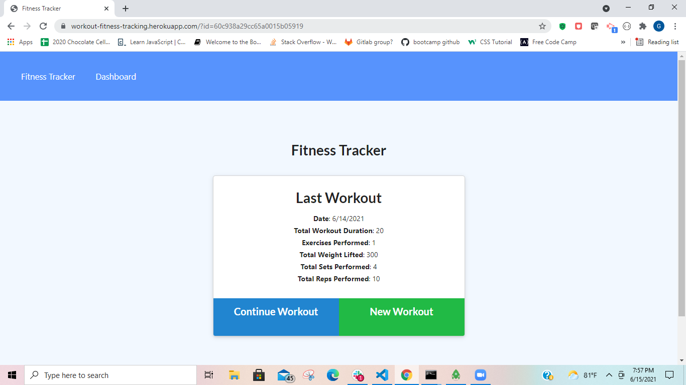
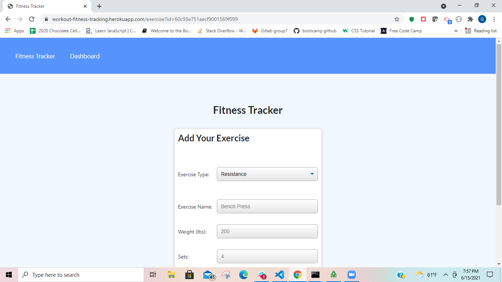
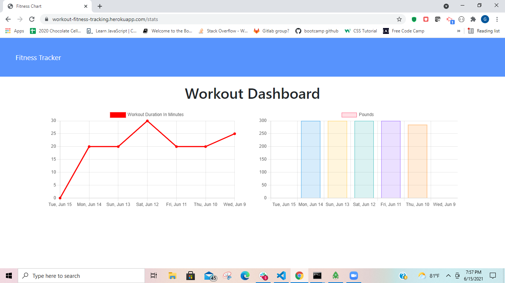

# workout-tracker

## Description
It is important for people to workout in order to stay healthy, and it is also important for active people to keep track of their activity. Teh workout-tracker app takes care of keeping track of your workouts.

## Usage
To use the application go to https://workout-fitness-tracking.herokuapp.com/ and start tracking your workouts! Use the "New Workout" button to create a new workout. "Continue Workout" button to continue a porevious workout. The Dashboard link will take you to a a page where you can see graphs that visually display your workouts.





## Installation
If you would like a local version of this application run this command in bash:
```bash
git clone https://github.com/Gpphelps/workout-tracker
```
Then at the root level of the created repo open an integrated terminal and run:
```bash
npm i
```
Make sure you have a connection to a mongooseDB running when you first open by running this command in a bash window:
```bash
mongod
```
Finally run in the repo's integrated terminal:
```bash
npm start
```
You now have a locally hosted version of the workout-tracker with all of its capabilities!

## Features 
This application features the use of mongoose-atlasDB to store the workout data from any user from anywhere.

## Contributing
If you would like to contribute in any way to this project please feel free to post an issue to the Github repository and I will address it as soon as possible.

## license
MIT

## Repository
https://github.com/Gpphelps/workout-tracker

## Deployed Application
https://workout-fitness-tracking.herokuapp.com/